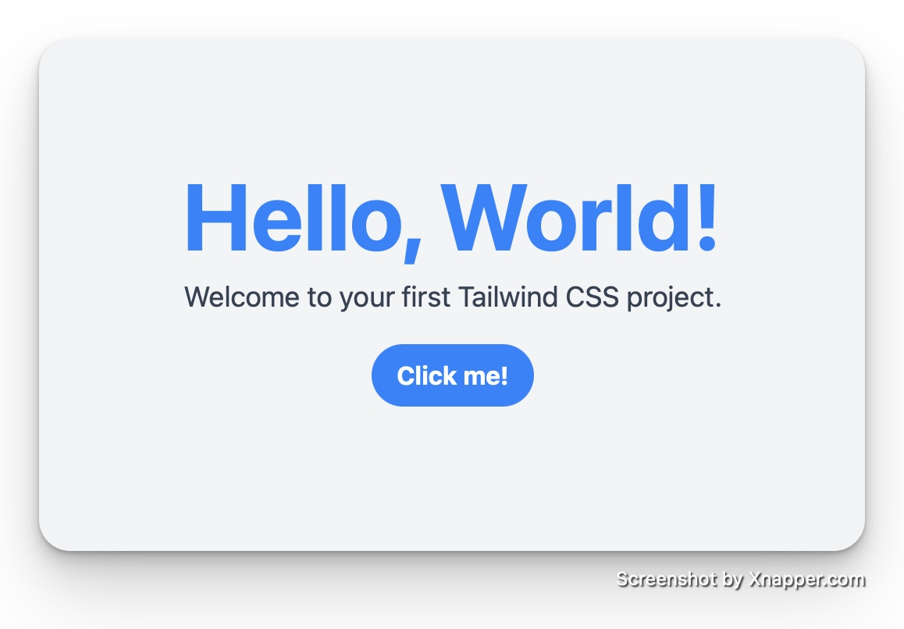

# Hello World

<sub>*last updated: 2024-04-13*</sub>
<br>
<sub>*comments: React.js | Tailwind CSS*</sub>



### 1. Create a New React Project

Create a new React project by running:

```sh
npx create-react-app hello-world-tailwind
cd hello-world-tailwind
```

### 2. Install Tailwind CSS

Install Tailwind CSS and its peer dependencies by running:

```sh
npm install -D tailwindcss postcss autoprefixer
npx tailwindcss init -p
```

This command installs Tailwind CSS, PostCSS, Autoprefixer, and creates a 'tailwind.config.js' and 'postcss.config.js' files in your project.

For future details regarding Tailwind CSS installation, visit https://tailwindcss.com/docs/installation

### 3. Configure Tailwind to Remove Unused Styles in Production

Open 'tailwind.config.js' and ensure it is configured to purge unused styles in production by adding the content array. This step is usually set up by default with the -p flag in the init command, but it's good to verify:

```js
module.exports = {
  content: [
    "./src/**/*.{js,jsx,ts,tsx}",
  ],
  theme: {
    extend: {},
  },
  plugins: [],
}
```

### 4. Include Tailwind in Your CSS

Open the 'src/index.css' file, and replace its content with the following Tailwind directives:

```css
@tailwind base;
@tailwind components;
@tailwind utilities;
```

### 5. Use Tailwind CSS in the App Component

Replace the content of 'src/App.js' with the following code to create a simple "Hello, World!" application styled with Tailwind CSS:

```jsx
import React from 'react';
import './index.css';

function App() {
  return (
    <div className="min-h-screen bg-gray-100 flex flex-col items-center justify-center">
      <header className="text-center">
        <h1 className="text-4xl font-bold text-blue-500 md:text-5xl lg:text-6xl">
          Hello, World!
        </h1>
        <p className="text-base text-gray-700 mt-2 md:text-lg">
          Welcome to your first Tailwind CSS project.
        </p>
      </header>
      <button className="mt-4 bg-blue-500 hover:bg-blue-700 text-white font-bold py-2 px-4 rounded-full transition duration-300 ease-in-out transform hover:-translate-y-1 hover:scale-110">
        Click me!
      </button>
    </div>
  );
}

export default App;
```

#### Explanation of Tailwind CSS Classes Used

1. **Responsive Typography**: The 'text-4xl', 'md:text-5xl', 'lg:text-6xl' classes make the font size responsive. The text size increases based on the width of the device (medium and large screens).

2. **Colors and Backgrounds**: 'bg-gray-100', 'text-blue-500', and 'hover:bg-blue-700' demonstrate how to apply background and text colors. The hover: prefix shows how to change the background color on hover.

3. **Spacing**: 'mt-2' and 'mt-4' are margin-top utilities that add spacing above elements. 'py-2' and 'px-4' are padding utilities that add padding inside elements vertically and horizontally.

4. **Rounded Corners**: 'rounded-full' applies fully rounded corners to elements, in this case, making the button circular if the content allows.

5. **Hover Effects**: The 'hover:-translate-y-1 hover:scale-110' combined with transition 'duration-300 ease-in-out' demonstrates a smooth hover effect where the button slightly moves up and enlarges.

6. **Flexbox Layout**: 'flex', 'flex-col', 'items-center', and 'justify-center' are used to center content vertically and horizontally on the page.

### 6. Run Your Application

Start your application by running:

```sh
npm start
```